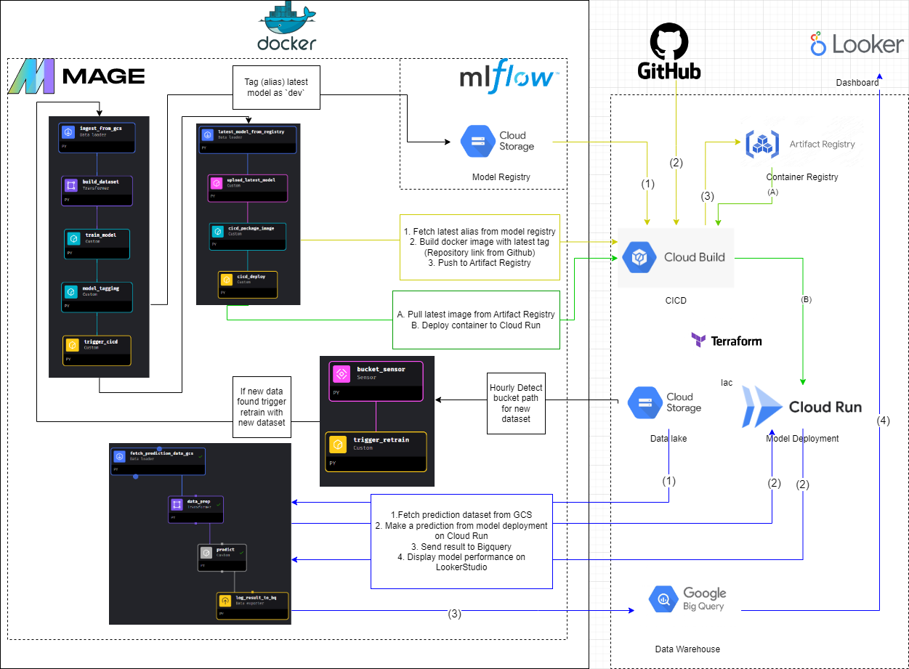

# Credit Card Fraud Prediction Project
This is an end-to-end MLOps project, part of the MLOps Zoomcamp. The project focuses on adopting MLOps practices and frameworks to enhance the productivity and reliability of the machine learning lifecycle.

This course is organized by [DataTalks.Club](https://datatalks.club). I appreciate the effort the instructors have put into this course, which has allowed me to learn MLOps-related skills for free. You can check out the MLOps Zoomcamp here: [MLOps Zoomcamp](https://github.com/DataTalksClub/mlops-zoomcamp)


## Project Overview
Credit Card Fraud Prediction is a data-driven machine learning project aimed at identifying fraudulent transactions in real-time to enhance the security and integrity of financial transactions. With the increasing sophistication of fraudulent activities, this project seeks to provide an automated solution to detect and mitigate fraudulent transactions, ultimately safeguarding users and financial institutions from potential losses.

## Problem Statement

The rise in credit card fraud necessitates effective detection systems. Traditional methods often fail to keep up with sophisticated fraud tactics. This project addresses the challenge of building a scalable solution to detect fraudulent transactions and aims to provide hands-on experience with MLOps practices.

## Project Objectives

Develop a Predictive Model:

1. Model Development: Create a machine learning model to predict fraudulent transactions using historical data.
2. MLOps Implementation: Learn and apply MLOps principles, including model deployment, monitoring, and lifecycle management.
3. Real-Time Prediction: Deploy the model for real-time fraud detection.
4. Monitoring and Maintenance: Set up systems for logging, performance tracking, and detecting model drift.
5. Visualization: Build dashboards for visualizing key metrics and model performance.

## Project Architect


## Tools & Technology
* Cloud: Google Cloud Platform (GCP)
* Code Repository: Github
* Experiment Tracking: MLFlow & Google Cloud Storage (GCP)
* Model Registry: MLFlow & Google Cloud Storage (GCP)
* Workflow Orchestration: Mage.ai
* Monitoring: Bigquery & Looker Studio (GCP)
* Model Deployment: containerized the model and Deploy on Cloud Run (GCP)
* Containerization tools: Docker, Docker Compose
* Container Registry: Artifact Registry (GCP)
* CI/CD Pipeline: Cloud Build (GCP)
* Infrastructure as Code (IAC): Terraform
* Programming Language: Python

### Project Progress
- [x] experiment tracking (MLFlow)
- [x] model registry (MLFlow)
- [x] workflow orchestration (Mage)
    - [x] Train new model
    - [x] Push model Registry
    - [x] CI/CD Deploy new model
- [x] model deployment 
    - [x] Containerization
    - [x] Artifact Registry
    - [x] Cloud Run
- [ ] model monitoring 
    - [] Evidently AI
    - [] Bigquery
    - [] LookerStudio
- [ ] testing framework
    - [] unit tetsing
    - [] integration testing
    - [] pylint
    - [] precommit (black, isort, pytest)
    - [] makefile
- [x] IaC Tools (Terraform)
- [x] cloud computing (GCP)
- [x] CI/CD pipeline (Cloud Build)

## Prerequisite

1. Fork this repository to your Github

2. Clone forked repository to your local path
```git
git clone https://github.com/<UserName>/Credit-Card-Fraud-Prediction.git
```

3. Install `python` 

4. Install `gcloud` (CloudSDK)

5. Install `terraform`


## Reproduce

### Step 1 - GCP Configuration

1. Create a new GCP account [Link](https://console.cloud.google.com/)

    1.1 (Optional) Create new project and remember the `PROJECT_ID`

    1.2 [Enable These API](https://cloud.google.com/endpoints/docs/openapi/enable-api): `CloudBuild`, `SecretManager`, `CloudRun`, `BigQuery`

2. Create new service account 

    2.1 IAM & Admin 

    2.2 Grant role `owner` (In production you should only grant minimum permission to each service-account)

    2.2.1 Go to `IAM` and Grant `Storage Object Admin`

    2.3 Click Action button -> Manage Key -> Add Key -> Create json -> Download key

    2.4 Put file in `credentials/`

    2.5 rename it to `service-account.json`

    2.6 you should have `credentials/service-account.json`

3. Run (`PROJECT_ID` from 1.1)
```gcloud
gcloud auth activate-service-account --key-file=credentials/service-account.json --project=PROJECT_ID
```

4. Cloudbuild Link Host & Repository on Github

    4.1 Go to cloudbuild `Repositories` (2nd Gen) then 

    4.2 click `connect new Host` -> `GitHub` 

    4.3 Fill region `us-central1` and name `Github` then click `Connect` Follow the popup to github account. 
    

    4.3.1 If You cant find your repository try again and select `install new account` and select repository that you forked
    

    4.4 Then, click `...` on the right side and select link repository. [Official Document](https://cloud.google.com/build/docs/automating-builds/github/connect-repo-github?generation=2nd-gen#connecting_a_github_host)

    4.5 Create 2 trigger with parameters below

    ```
    Name: CI-package-image
    Region: us-central1
    Event: Manual invocation
    Source: 2nd Gen
    Repository: Forked Repository
    Branch: main
    Cloudbuild Configuration File: deployment/cloudbuild.yaml
    service-account: your new service-account
    ```

    ```
    Name: CD-deploy-model
    Region: us-central1
    Event: Manual invocation
    Source: 2nd Gen
    Repository: Forked Repository
    Branch: main
    Cloudbuild Configuration File: deployment/cloudbuild-cloudrun.yaml
    service-account: your new service-account
    ```

    

5. Prepare dataset

```
sh init.sh
```

6. Create `.env` at current directory
```
GOOGLE_CLOUD_PROJECT=<YOUR-PROJECT>
GOOGLE_APPLICATION_CREDENTIALS=credentials/service-account.json
GOOGLE_CLOUD_LOCATION=us-central1
DATA_SET_BUCKET=credit-card-fraud-prediction
MODEL_REGISTRY_BUCKET=credit-card-fraud-model-registry
BIGQUERY_DATASET=model_monitoring
BIGQUERY_TABLE=model_predictions
```

6.1 Edit cloudbuild artifact registry repository

In File `deployment/cloudbuild.yaml` and `deployment/cloudbuild-cloudrun.yaml` 

Please change this to your project `us-central1-docker.pkg.dev/<project-id>/mlops/fraud.prediction:latest`

7. Create Others infrastructure with terraform

    7.1 `cd terraform`

    7.2 Create `terraform/.env`
    ```
    TF_VAR_project_id="<YOUR-PROJECT>"
    TF_VAR_region="us-central1"
    TF_VAR_location="us-central1"
    TF_VAR_credentials="../credentials/service-account.json"
    TF_VAR_data_lake_bucket_name="credit-card-fraud-prediction"
    TF_VAR_model_registry="credit-card-fraud-model-registry"
    TF_VAR_artifact_registry_location="us-central1"
    TF_VAR_artifact_registry_name="mlops"
    TF_VAR_bigquery_dataset_id="model_monitoring"
    TF_VAR_bigquery_model_predictions_table="model_predictions"
    TF_VAR_bigquery_model_runtime_table="model_runtime"
    ```

    7.2.1 Run `source <(tr -d '\r' < .env)`

    7.3 Run `terraform init`

    7.4 Run `terraform plan`

    7.5 Run `terraform apply` -> `yes`

### Step 2 - Setup mage & mlflow

1. Run `docker compose build`

2. Run `docker compose up -d`

## Step 3 - train model

1. Go to `http://localhost:6789`

2. `Pipeline` -> `model_training` -> `trigger` -> `Run@once`

3. Go to cloudbuild and checkout CI/CD

4. Go to Artifact Registry and checkout image

## Step 4 - model deployment

1. Cloudbuild should create your Cloudrun deployment by now

2. Get your cloudrun URL and place it `mage\custom\predict.py` -> `API_URL`


3. Go to `Pipeline` -> `Prediction` -> `Trigger` -> `Run@once`

## Step 5 - Hourly Retrain

1. Go to `Pipeline` -> `retrain_model` -> `Trigger` -> `Run@once`

2. This will redo the step 3&4 again

## Shut down project

1. `docker compose down`

2.  `cd terraform`

2.1 `terraform destroy`

## Debug & Troubleshooting


- Cloudbuild: `Permission &#39;storage.objects.get&#39; denied on resource (or it may not exist).`

Solution: Granting Minimal permission to your [compute-engine-service-account](https://cloud.google.com/build/docs/deploying-builds/deploy-cloud-run#console)


- Artifact Registry: `Unauthenticated requests do not have permission "artifactregistry.repositories.downloadArtifacts"` 

Solution: Make sure to config your local docker auth. [Document](https://cloud.google.com/artifact-registry/docs/docker/authentication#gcloud-helper)
```
gcloud auth configure-docker \
    <region>-docker.pkg.dev
```
